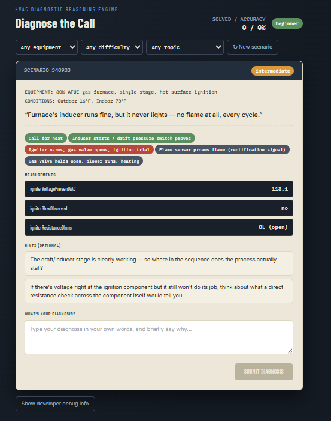
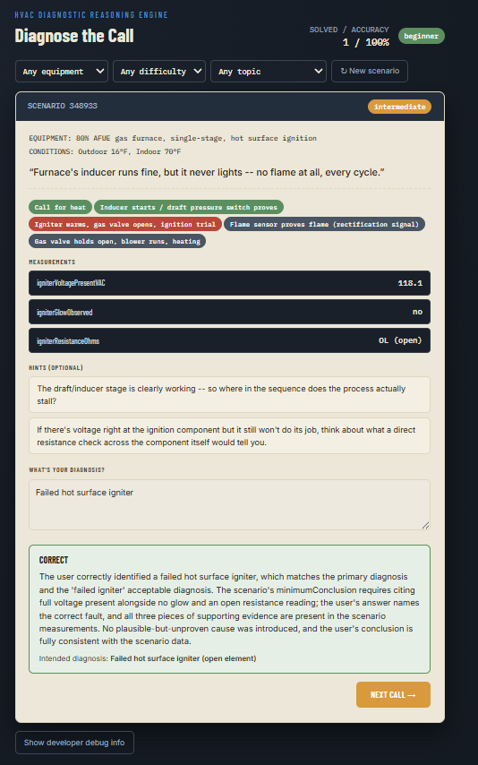

# HVAC Troubleshooting Diagnostic Simulator

Designed and developed an interactive HVAC troubleshooting simulator using AI-assisted development. Built diagnostic logic around real HVAC failure conditions, equipment states, measurements, and troubleshooting sequences, with an emphasis on realistic fault isolation and technical training.

## Overview

This simulator provides interactive HVAC troubleshooting scenarios where users diagnose equipment faults using system symptoms, measurements, and available diagnostic information.

The goal is to make troubleshooting practice more realistic than simply identifying a fault from a list of symptoms.

## Features

- **Interactive troubleshooting scenarios**
- **Multiple equipment and fault conditions**
- **Realistic system measurements**
- **Diagnostic decision-making**
- **Progressive fault isolation**
- **Equipment state simulation**
- **Multiple difficulty levels**
- **Immediate feedback on diagnostic decisions**

## What I Designed

- **Diagnostic logic and decision flow**
- **Equipment and failure scenarios**
- **System states and measurements**
- **Fault-isolation logic**
- **Training progression and difficulty**
- **User interaction and troubleshooting workflow**

## AI-Assisted Development

AI was used as a development tool throughout the project for implementation, iteration, debugging, and refinement.

The system design, HVAC troubleshooting logic, scenarios, requirements, and testing were developed and evaluated as part of the project.

## Demo

**Try the Interactive Simulator →** https://claude.ai/public/artifacts/4cf22912-b805-41cd-bbd6-75ae7f6909ba

## Screenshots

